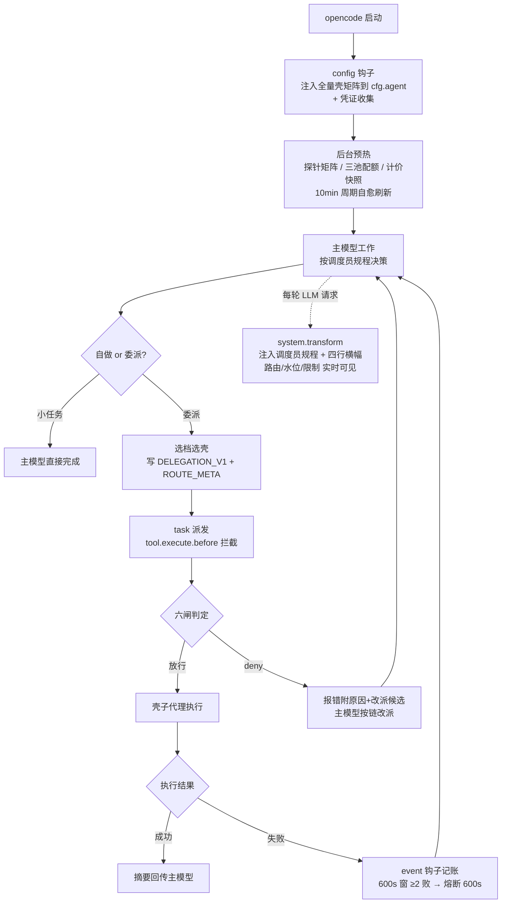

# opencode-switchman

**[English](./README.en.md)** | 中文

> **🎬 [在线演示文稿 · 能力全览](https://mrzturn.github.io/opencode-switchman/)**（GitHub Pages，支持手机滑动翻页）
>
> [](https://mrzturn.github.io/opencode-switchman/)

OpenCode 六档壳矩阵编排插件——让主模型成为调度员，把任务按「认知档位」委派给跨三大模型池的子代理空壳，插件层做确定性拦截与配额感知路由。

如果你同时持有多个模型订阅（GitHub Copilot premium 积分、智谱 GLM Coding Plan、DeepSeek 按量余额），却总是一个模型用到天荒地老、水位盲飞、高峰全价硬扛——opencode-switchman 就是为你准备的。

## 安装与使用

### 前置条件

- [opencode](https://opencode.ai)（桌面端或 CLI）
- 至少配置一个受支持的模型池（三池可任意组合，全部可选）：
  - **GitHub Copilot**：opencode 内 GitHub 登录（`/connect`）即可
  - **GLM**：自定义 provider（`zhipuai-coding-plan`，baseURL `https://open.bigmodel.cn/api/coding/paas/v4` + apiKey）
  - **DeepSeek**：自定义 provider（`deepseek` + apiKey）
- 凭证零配置：插件从 opencode 鉴权层（auth.json / provider options / 环境变量）**只读**获取，不另存密钥、绝不自行刷新 token

### 方式一：npm 安装（推荐，发布后可用）

在 opencode 配置（`~/.config/opencode/opencode.json` 或项目 `opencode.json`）中添加：

```json
{
  "plugin": ["opencode-switchman"]
}
```

opencode 启动时会自动经 Bun 安装并加载该 npm 包，无需其他步骤。

需要自定义选项时使用元组形式：

```json
{
  "plugin": [
    ["opencode-switchman", { "billingWindow": { "glmPeakHours": [14, 18] } }]
  ]
}
```

### 方式二：源码安装

```bash
git clone https://github.com/mrzturn/opencode-switchman.git
cd opencode-switchman
bun install
bun run build   # 生成 dist/opencode-switchman.js
```

然后二选一：

**a) 配置引用（推荐，随仓库更新）**——在 opencode 配置的 `plugin` 数组中用 `file://` 指向仓库目录：

```json
{
  "plugin": ["file:///absolute/path/to/opencode-switchman"]
}
```

插件直接加载仓库内的 `dist` 产物；`git pull` 后重跑 `bun run build` 并重启 opencode 即完成升级。此方式与 plugins 目录部署**二选一**，同时使用会双重注入。

**b) 部署单文件**——`bun run deploy` 构建并复制到全局插件目录 `~/.config/opencode/plugins/opencode-switchman.js`，自动加载。桌面端内嵌核心跑 Node 运行时，`deploy` 产出的单文件 bundle 即为此设计。

> **注意**：`plugin` 数组中的 `file://` 引用与 plugins 目录部署不可并存（同名插件会加载两份）；发布 npm 后，把 `file://...` 换成 `"opencode-switchman"` 即可切换为 npm 安装。重启 opencode 生效。

> **从旧版（switchman.js）升级**：请删除旧的 `~/.config/opencode/plugins/switchman.js`，避免新旧两份插件同时注入；状态目录已迁移至 `~/.config/opencode/opencode-switchman/`（旧目录可删，全部状态自动重建）。

### 验证安装

启动 opencode 后，主模型每轮系统提示中会出现四行实时横幅（即调度依据）：

```
[路由] economy: glm-53f-low→ds-v4fv-off | mechanical: glm-53f-high→ds-v4fv-off | main: glm-53-high→ds-v4p-high | ...
[水位] GLM 5h窗 20% 周 7%(09-04 10:00刷新) | Copilot 积分不限量 已用3885(2026-09-01刷新) | 建议: ...
[限制] down: 无 | reviewer 须异族（producer family ≠ 壳 family） | DeepSeek 仅链尾兜底
```

同时日志可见 `[opencode-switchman] 已注入 52 只模型空壳（agent）`。

### 配置项

| 选项 | 默认 | 说明 |
|---|---|---|
| `quota.glm / quota.deepseek / quota.copilot.enabled` | `true` | 三池配额感知逐池开关（无凭证自动跳过） |
| `quota.glm.fiveHourReservePct` | `90` | GLM 5 小时窗预留水位（%）：达到即硬拦 GLM 壳避免用满 429；周额度仍只认 100% |
| `quota.deepseek.lowBalanceWarnCny` | `10` | DeepSeek 余额预警阈值（元）：低于该值横幅 [水位] 提示（仅预警不硬拦） |
| `cost.enabled` | `true` | models.dev 计价快照参与选链 tiebreaker |
| `billingWindow.glmPeakHours / dsPeakRanges` | GLM 工作日 14–18 | 高峰窗口定义（影响选池排序） |
| `providers.glm / providers.deepseek` | `["zhipuai-coding-plan","glm","zai"]` / `["deepseek"]` | 池对应的 provider id 清单（凭证收集用） |
| `banner.enabled` | `true` | 四行横幅注入开关 |
| `rules.enabled` | `true` | 调度员规程（AGENTS.md）随包注入开关 |
| `lanes` | 内置六档链 | 自定义各档壳链（覆盖内置偏好序） |

## 核心思想

### 问题

多订阅并存的真实痛点：

1. **认知错配**：让旗舰模型干扫描清点的杂活，token 花在不该花的地方；让轻量模型做架构设计，返工反而最贵
2. **水位盲飞**：GLM 5 小时窗耗尽了还在硬撞、Copilot premium 积分月底作废没花完、DeepSeek 余额见底才发现
3. **单点视角**：复审用同一个模型族自查，盲区相同，审不出问题
4. **协议松弛**：「让 XX 帮我看看」式委派无结构、无校验，子代理拿到的是含糊任务

### 解法：调度员 + 壳矩阵 + 确定性拦截

opencode-switchman 把编排拆成三层，各司其职：

| 层 | 载体 | 职责 |
|---|---|---|
| **认知层** | 主模型（调度员）+ 随包注入的调度员规程 | 任务四维画像（认知强度×机械度×上下文×紧急度）、决定自做还是委派、选档选壳、写 DELEGATION_V1 委派 prompt |
| **执行层** | 「模型×档位」空壳子代理（如 `glm-mx-53-high`） | 只绑定模型与思考档位，角色由委派 prompt 动态赋予（programmer/tester/reviewer 等 14 角色） |
| **确定性层** | 插件本体 | 六闸拦截、ROUTE_META 硬校验、配额/成本感知选链、探针熔断自愈、四行横幅实时注入 |

**Token 经济学为第一性原则**：返工是最贵的 token。由此派生六档认知分层——

| 档位 | 典型角色 | 用什么 |
|---|---|---|
| economy | clerk / scouter 扫描清点 | 最便宜的轻量模型低档 |
| mechanical | tester / ops 回归与脚本 | 轻量模型高档 |
| main | programmer / uiux / data-analyst | 主力模型常规档 |
| hard | planner 架构核心 | 最强模型最高档 |
| vision | observer 看图 | 视觉模型 |
| review | reviewer / 专家席 审案 | **强制异模型族**（防同族盲区） |

水位只影响排序（用满不浪费），唯一硬拦是「调用必失败」（额度确定耗尽）；DeepSeek 按量池恒居链尾兜底，自动路由绝不选它，点名才可用。

## 工作原理

### 生命周期流程



### 六闸拦截（顺序即优先级）

主模型派发子代理时，插件在 task 工具执行前做确定性校验，任一命中即 deny 并附改派候选：

| 闸 | 判定 | 语义 |
|---|---|---|
| 1 注册表 | 壳未启用/未探测 | 禁派未注册面 |
| 2 探针矩阵 | 组合实测 down | 拦明确不可用 |
| 3 熔断 | 600s 窗内 ≥2 败 | 「连续失败熔断中，约 10 分钟自动恢复」 |
| 4 池耗尽 | 配额判定必失败 | 附人读原因（GLM 100% / Copilot 确定耗尽 / DS 欠费） |
| 5 协议 | ROUTE_META 缺失/非法 | deny 附样例与合法值表 |
| 6 语义 | 同族复审 / rw→ro 壳 / 图像→非视觉壳 / auto 误选付费兜底 | 「复审须异族视角」等 |

ROUTE_META 是嵌在委派 prompt 内的单行协议，六键六值，插件逐字段校验：

```
ROUTE_META {"lane":"main","role":"programmer","producer_family":"glm","capability":"rw","modality":"text","source":"auto"}
```

### 数据面（全部自动、fail-open）

- **探针**：对三池发起真实请求探活，矩阵落盘（TTL 600s），down 组合自动进降级链
- **配额**：GLM monitor / DeepSeek balance / Copilot `copilot_internal/user` 直查，无代理、分层 TTL 缓存
- **成本**：models.dev 计价快照，水位同分时便宜者前（tiebreaker 弱参与）
- **横幅**：每轮系统提示注入 `[路由][水位][限制][更新]` 四行，调度员实时可见
- **fail-open 铁律**：任何钩子异常只写 stderr 绝不阻塞主流程；配额未知不硬拦、熔断器与探针兜底

### 状态目录

`~/.config/opencode/opencode-switchman/`：`shells.json`（可选自定义覆盖，缺省用插件内置矩阵）、`model-matrix.json`（探针）、`routing.json`（熔断）、`failures.log`（记账）、`*-quota.json` / `ds-balance.json`（配额缓存）、`costs.json`（计价）、`delegation-template.md`（委派模板全文）。

## 模型矩阵维护

内置矩阵基于作者的启用面（13 模型 → 52 壳）。你的模型管理与之不同时，从源码重生成：

```bash
# 1. 同步权威启用面（opencode 模型管理中打开的模型，每行 provider/model-id）
$EDITOR scripts/visible-models.txt
# 2. 重生成矩阵（拉取 models.dev 档位声明）
bun run gen:shells
# 3. 重启 opencode
```

模型临时 down 无需维护——探针每 10 分钟后台刷新，自动进降级/熔断。

## 开发与验证

```bash
bun install
bun test            # 33 项行为契约 fixture（META/六闸/选链/熔断/配额判定）
bunx tsc --noEmit   # 类型检查
bun run build       # 重新生成矩阵并打包单文件 bundle
```

## 文档

- [技术方案（契约/算法/实测记录）](./docs/2026-08-28-opencode-switchman-技术方案.md)
- [调度员规程 AGENTS.md](./AGENTS.md)（随包经系统提示自动注入，无需手动安装）
- 委派模板 DELEGATION_V1：安装后见状态目录 `delegation-template.md`

## License

[MIT](./LICENSE)
