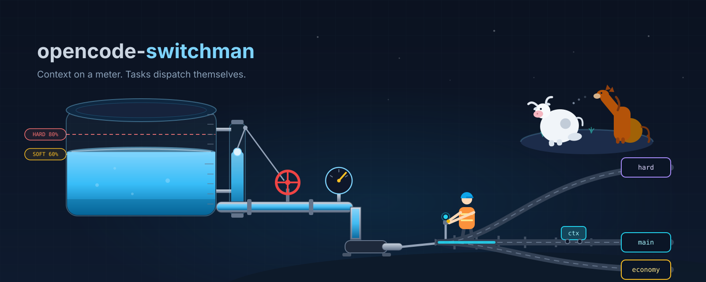

# opencode-switchman

[English](./README.md) | **中文**

> 上下文有水位，任务自己派。



> 交互式演示：[opencode-switchman 宣传页](https://mrzturn.github.io/opencode-switchman/index.zh.html)

一个 [OpenCode](https://opencode.ai) 编排插件，核心就两件事：

**1. 上下文水位控制。** 插件每轮实测你的会话上下文：自读有预算闸，模型没法闷头把整个仓库吞进上下文；软/硬/压三档水位依次触发提醒、收尾、自动备份压缩交接；派出去的每个子代理各有一条硬顶。上下文不再滚雪球——会话跑一整天，token 也不会被自己的历史累积一口口吃掉。

**2. 自动化决策调度。** 主模型转型调度员：给任务画像，按六个认知档位（economy / mechanical / main / hard / vision / review）派给子代理空壳执行；插件做确定性拦截、加权评分、失败自愈隔离，每一条路由决策都可追溯。

在此之上：

- **有多个模型或多个订阅？这个插件就是为你准备的。** GitHub Copilot、智谱 GLM Coding Plan、DeepSeek——或任意 opencode 供应商——会被编排成一个池子统一调度：配额感知排序、高峰避让、强制跨家族评审。
- **只有一个模型？照样好用。** 光是上下文控制与智能派发，就够你把这一个模型用到天荒地老——会话再久，上下文也不会失控膨胀。

## 安装

一条命令，首次安装与后续更新通吃。装完重启 opencode。

```bash
curl -fsSL https://raw.githubusercontent.com/mrzturn/opencode-switchman/main/scripts/setup.sh | bash
```

或

```bash
npx -y opencode-switchman@latest
```

或

```bash
bunx opencode-switchman@latest
```

两种方式都会把 opencode 配置里的 `plugin` 条目改写为最新精确版本，并清理旧插件缓存。手动 npm 安装、源码构建、以及「为什么必须精确版本号」的说明：[安装细节](./docs/reference.zh.md#安装)。

嫌麻烦？让 AI 替你装——把下面这段话复制给你正在用的 AI：

<details open>
<summary><strong>AI 代安装提示词</strong></summary>

```text
请严格按照官方说明为我的 opencode 安装并配置 opencode-switchman 插件。

官方来源（以此为准，不要凭记忆猜测）：
- GitHub 仓库：https://github.com/mrzturn/opencode-switchman
- npm 包：https://www.npmjs.com/package/opencode-switchman
请先阅读仓库 README 的「安装」章节，然后严格照做。

步骤：
1. 安装 npm 上发布的最新版本：运行 `npx -y opencode-switchman@latest`（或 `bunx opencode-switchman@latest`），它会把我的 opencode 配置里的 `plugin` 条目改写为精确最新版本（若我用的是项目级 `opencode.json`，它同样适用）。
2. 完成功能配置：插件全部配置都在我 opencode 配置目录下独立的 `opencode-switchman.jsonc` 文件中，首次启动自动生成并带注释；请对照我的 provider（如 `zhipuai-coding-plan` / `deepseek` / `github-copilot`）检查并按需调整。
3. 校验配置正确性、确保 opencode 能正常加载启动运行该插件：在 opencode 内运行 `/switchman-doctor` 出本地脱敏诊断报告并修复所有报错；然后重启 opencode 确认插件确实已加载——日志应出现 `[opencode-switchman] injected N model shells (agents)`，且主模型的系统提示中应带有实时 `[ROUTES]/[WATERMARK]/[LIMITS]` 横幅块。

三个步骤全部通过才算完成；请汇报你做的改动并给出验证证据。
```

</details>

**前置条件**：[opencode](https://opencode.ai)，推荐 CLI/TUI（弹窗、侧栏、横幅在 TUI 里最完整；桌面端共享同一份配置与状态）。任意供应商可用；Copilot / GLM / DeepSeek 额外享有配额感知路由。凭证从 opencode 自身鉴权层只读获取，插件不存密钥。

## 快速上手

五步跑通。完整图文版：**[docs/quick-start.zh.md](./docs/quick-start.zh.md)** / [English](./docs/quick-start.md)。

1. **连接 provider** —— TUI 里运行 `/connect`：Copilot 走 OAuth、DeepSeek 粘 API key；GLM Coding Plan 在 `opencode.json` 里加 `zhipuai-coding-plan` 自定义 provider。
2. **挑选参与编排的模型** —— `/models` 后按 `ctrl+f` 收藏（桌面端：「管理模型」开关）。
3. *（可选）***`/modelRank`** —— 固定你自己的能力排名，所有决策面压过系统评分。
4. *（可选）***`/poolConfig`** —— 为六个任务池定制候选清单。
5. **重启、验证** —— 确认 `[ROUTES]`/`[LIMITS]` 横幅与侧栏 `switchman` 面板，有不对劲就跑 `/switchman-doctor`。之后正常使用即可。

## 核心功能

**核心**

- **上下文水位控制** —— 会话上下文每轮实测（`[WATERMARK:SESSION]`），软/硬/压三档水位；逐轮自读预算闸自动约束越界读取；每个子代理一条硬顶（触顶交回总结、会话终止）；压水位自动交接（完整分叉备份＋压缩），任务不中断。
- **自动化决策调度** —— 随包调度员规程让主模型学会派活；六个认知档位把任务交给合适的模型和思考档；六道确定性闸门逐条校验每次派发；失败自动熔断隔离、自愈恢复。

**辅助**

- **多订阅编排** —— Copilot / GLM / DeepSeek 跨池配额感知路由（任意供应商均可参与）、高峰避让、计费加权、跨家族评审强制。
- **手动覆盖** —— `/poolConfig`、`/modelRank`、`/expert`、`/handover`、`/switchman-doctor`、`/switchman-update`。
- **看得见** —— 每轮系统提示注入实时四行横幅、TUI 侧栏状态面板、tmux 窗格镜像、按会话归档的工件工作区、路由决策审计日志。

完整配置项表、架构与内部机制：[docs/reference.zh.md](./docs/reference.zh.md)（English: [docs/reference.md](./docs/reference.md)）。

## 文档

- 快速上手（图文）：[中文](./docs/quick-start.zh.md) · [English](./docs/quick-start.md)
- 完整手册（配置、命令、架构）：[中文](./docs/reference.zh.md) · [English](./docs/reference.md)
- 技术方案（契约/算法/实测记录）：[docs/2026-08-28-opencode-switchman-technical-design.md](./docs/2026-08-28-opencode-switchman-technical-design.md)
- 发布记录：[CHANGELOG.md](./CHANGELOG.md)

## 计划与展望

近期计划接入更多供应商的配额支持——在 Copilot / GLM / DeepSeek 之外，覆盖更多订阅制与按量付费池。你的供应商还没被覆盖？欢迎[提 issue](https://github.com/mrzturn/opencode-switchman/issues)，我会根据实际情况安排优化。功能建议与 bug 反馈同样欢迎。

## 为爱发电

本项目开源、免费，也会一直免费下去。但维护它并不免费：要支持和测试各家供应商对本插件的兼容适配，需要开通很多订阅、一个一个实地调试，每一轮都是真金白银的消耗。

如果这个插件真的帮到了你，手头也宽裕，可以请作者喝杯咖啡。在此万分感谢。

| 支付宝 | 微信支付 | 微信扫码为他点赞 |
|:---:|:---:|:---:|
|  |  |  |

## License

[MIT](./LICENSE)
