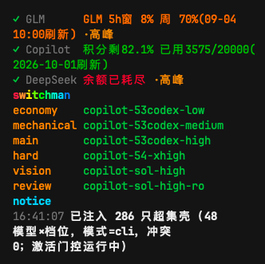
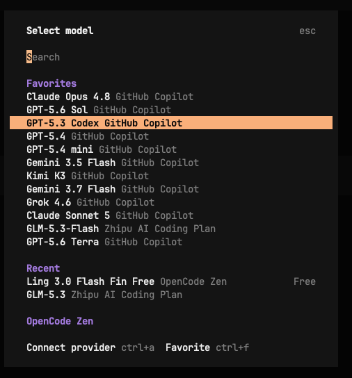
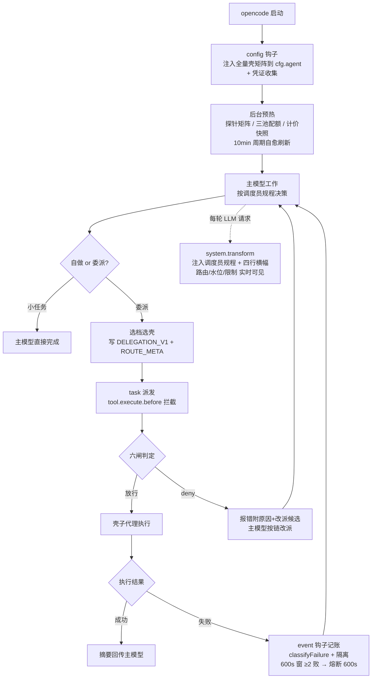

# opencode-switchman

[English](./README.md) | **中文**

> ### 🎯 全自动模型矩阵 ＋ 自主决策 ＝ 让每一个 token 都花在最该花的地方，一个都不浪费

> **🎬 [在线演示文稿 · 能力全览](https://mrzturn.github.io/opencode-switchman/index.zh.html)**（GitHub Pages，支持手机滑动翻页）
>
> [](https://mrzturn.github.io/opencode-switchman/index.zh.html)

OpenCode 六档壳矩阵编排插件——让主模型成为调度员，把任务按「认知档位」委派给跨任意 opencode 供应商的子代理空壳，插件层做确定性拦截、加权模型评分、可追溯路由决策与失败自愈隔离；glm / deepseek / copilot 三池额外享有配额感知路由。

如果你同时持有多个模型订阅（GitHub Copilot premium 积分、智谱 GLM Coding Plan、DeepSeek 按量余额），却总是一个模型用到天荒地老、水位盲飞、高峰全价硬扛——opencode-switchman 就是为你准备的。

## 安装与使用

### 前置条件

- [opencode](https://opencode.ai)（桌面端或 CLI）
- 任意 opencode 供应商均可接入，以下三池额外享有额度控制（可任意组合，全部可选）：
  - **GitHub Copilot**：opencode 内 GitHub 登录（`/connect`）即可
  - **GLM**：自定义 provider（`zhipuai-coding-plan`，baseURL `https://open.bigmodel.cn/api/coding/paas/v4` + apiKey）
  - **DeepSeek**：自定义 provider（`deepseek` + apiKey）
- 凭证零配置：插件从 opencode 鉴权层（auth.json / provider options / 环境变量）**只读**获取，不另存密钥、绝不自行刷新 token

### 安装 / 更新（两条一键路径）

两条命令均同时覆盖首次安装与后续更新（幂等，可重复执行）：自动把 opencode 配置与 `tui.jsonc` 的 `plugin` 条目改写为最新精确版本 `opencode-switchman@x.y.z`（JSONC 注释原样保留）、清理旧插件缓存（`~/.cache/opencode/packages/opencode-switchman*`），升级场景在横幅标记「已升级待重启」——**重启 opencode 后生效**。

**一键脚本（推荐）**

```bash
curl -fsSL https://raw.githubusercontent.com/mrzturn/opencode-switchman/main/scripts/setup.sh | bash
```

**npx / bunx**

```bash
npx -y opencode-switchman@latest    # 或：bunx opencode-switchman@latest
```

> npx 路径自 ≥0.2.1 发布起可用（包内自带 `update` bin 入口）。

> **为什么条目是精确版本，而不是裸包名 / `@latest`**：opencode ≤1.18.x 的插件缓存按 spec 名固定目录（如 `~/.cache/opencode/packages/opencode-switchman`），首次装入后不再向 npm 查询新版本——裸名与 `@latest` 会一直复用旧缓存（实测从 0.0.1 钉死不升级）。精确版本号每个版本一个独立缓存目录，所以更新器直接改写版本号。

插件内升级入口 `/switchman-update` 已改为调用同一更新器（旧版直接 `npm install` 的方式对 opencode 实际加载路径无效）。

### 方式一：npm 安装（手动）

在 opencode 配置（`~/.config/opencode/opencode.json` 或项目 `opencode.json`）中添加：

```json
{
  "plugin": ["opencode-switchman"]
}
```

opencode 启动时会自动经 Bun 安装并加载该 npm 包，无需其他步骤。后续升级请用上面的「一键更新」，或在 opencode 内执行 `/switchman-update`。

> **除插件安装外无需改 opencode 配置**：全部插件配置（水位、计费、高峰、阈值、横幅、矩阵、自定义档链等）都在独立文件 `opencode-switchman.jsonc` 中（见下节），首启自动生成、带中文注释。旧的元组 options（`["opencode-switchman", {...}]` 第二项）已弃用，兼容保留一代（显式值仍优先，`/switchman-doctor` 会提示 SWM044 并建议迁移）。

### 方式二：源码安装

```bash
git clone https://github.com/mrzturn/opencode-switchman.git
cd opencode-switchman
bun install
bun run build   # 生成 dist/opencode-switchman.js
```

然后二选一：

**a) 配置引用（推荐，随仓库更新）**——在 opencode 配置的 `plugin` 数组中用 `file://` 指向仓库目录：

```json
{
  "plugin": ["file:///absolute/path/to/opencode-switchman"]
}
```

插件直接加载仓库内的 `dist` 产物；`git pull` 后重跑 `bun run build` 并重启 opencode 即完成升级。此方式与 plugins 目录部署**二选一**，同时使用会双重注入。

**b) 部署单文件**——`bun run deploy` 构建并复制到全局插件目录 `~/.config/opencode/plugins/opencode-switchman.js`，自动加载。桌面端内嵌核心跑 Node 运行时，`deploy` 产出的单文件 bundle 即为此设计。

> **注意**：`plugin` 数组中的 `file://` 引用与 plugins 目录部署不可并存（同名插件会加载两份）；发布 npm 后，把 `file://...` 换成 `"opencode-switchman"` 即可切换为 npm 安装。重启 opencode 生效。

> **从旧版（switchman.js）升级**：请删除旧的 `~/.config/opencode/plugins/switchman.js`，避免新旧两份插件同时注入；状态目录已迁移至 `~/.config/opencode/opencode-switchman/`（旧目录可删，全部状态自动重建）。

### 统一配置：opencode-switchman.jsonc

**除插件安装（opencode 配置的 `plugin` 数组）外，插件全部配置都在独立文件 `opencode-switchman.jsonc`**——首次启动在 OpenCode 配置目录自动生成（优先级：`OPENCODE_CONFIG_DIR`、`$XDG_CONFIG_HOME/opencode`、`~/.config/opencode`），带 `$schema` 编辑器提示与逐键中文注释，坏值 fail-open 回退缺省；改文件后在 opencode 内重跑一次配置（或重启）即生效，`/switchman-doctor` 可出本地、脱敏且不联网的诊断报告。

**providers——供应商策略段**：随包内置稳定键 `deepseek`、`zhipuai-coding-plan`、`github-copilot`（与 opencode 官方 provider ID 一致），且**任意 opencode 官方/自定义 provider 键均合法**——未知键按自定义 provider 处理（通用缺省参与编排；对内置键的近似拼写 doctor 会给 warn 建议）。`observe` 控制配额查询与横幅展示，`enabled` 独立控制水位、高峰和耗尽是否参与路由（默认分别为 `true`、`false`）。`billing` 显式声明计费结构——`subscription`（评分系数 1.0）或 `api`（0.85，同 tier 内沉底）；这是计费优先级的唯一来源（不从 models.dev/auth 推断）。`peak` 高峰区间使用 ISO 周日 `1`–`7` 与 `[start,end)` 的 `HH:mm`；出厂缺省 GLM 工作日 14:00–18:00、DeepSeek 工作日 09:00–12:00 与 14:00–18:00。

**行为段**（`quota` / `cost` / `capability` / `matrix` / `banner` / `rules` / `lanes`）：详见下方「配置项」表——同样只写这一个文件。

### 验证安装

启动 opencode 后，主模型每轮系统提示中会出现四行实时横幅（即调度依据）：

```
[路由] economy: glm-53-low→claude5-low→gem31pro-low | mechanical: claude5-medium→gem31pro-medium→gem37f-medium | main: glm-53-high→ds-v4p-high→claude5-high | ...
[水位] GLM 5h窗 20% 周 7%(09-04 10:00刷新) | Copilot 积分不限量 已用3885(2026-09-01刷新) | 建议: ...
[限制] down: 无 | retired: 0 模型已下线 | reviewer 须异族（producer family ≠ 壳 family） | api 计费与未知模型按系数沉底（billing=subscription 显式配置优先）
[更新] 发现新版本：/switchman-update 或 /switchman-ignore
```

同时日志可见 `[opencode-switchman] 已注入 N 只模型空壳（agent）`——N 随有凭证 provider 的模型面动态变化。六档候选由能力分×档位亲和×计费/未知组系数算法生成，并经 vision/review 结构门过滤，无任何厂商预留席位；运行期再按健康、水位与成本选出当前链首。

### 侧边栏状态面板（TUI 插件，可选）

v0.2.0 在 OpenCode TUI 侧边栏底部新增实时 `switchman` 面板，把路由状态收敛成一眼可读的运行视图：已观察 provider 的水位、高峰标记与渐变告警色，六个任务档位当前最佳候选，新增模型/provider 的「需要重启」标记，以及最新一条运行通知。面板每 2 秒轮询本地状态；原先会刷屏、遮挡输入框的非横幅 `stderr` 通知不再干扰操作。这是一套独立的 TUI Slot 插件（`src/tui.tsx`，导出路径 `opencode-switchman/tui`），与上面的 server 端 hook 插件互相独立。





TUI 插件没有目录自动发现机制，需要在 **`tui.jsonc`/`tui.json`** 的 `plugin` 数组里加入同一个包 spec（npm 安装或 `opencode plugin <spec>` 会自动完成；只有手改配置或从源码用 `mode:local`/`mode:prod` 时才需要手动确认）：

```json
{
  "plugin": ["opencode-switchman"]
}
```

## 手动覆盖层：/poolConfig 与 /modelRank（v0.2.5 新增）

两个手动配置命令让你用配置压过系统默认决策，全部状态落盘、可手改、保存即热加载（mtime 感知，即时生效，侧栏同步刷新）。会话式（AI 交互换算 CLI）版本为同名的 `-chat` 后缀命令：

### /poolConfig —— 任务池选配（手动弹窗；会话式用 /poolConfig-chat）

- **TUI（/poolConfig）**：弹出选择框（与选模型/思考等级同款交互）——先选任务池（economy / mechanical / main / hard / vision / review），再对全部可用模型上下勾选：选中即参与该池、再选即移出，附能力档标注，改动实时落盘并 toast 回执。
- **非 TUI / 会话内（/poolConfig-chat）**：会话式流程——注入各池选配总览（带池名可看 `[x]/[ ]` 完整清单），回复「main 只留 3 5」「economy 勾 1、取消 2」由 agent 调 `switchman-config.js` 落盘。
- **语义**：选配=让各任务池的候选模型**体现差异化**（如 economy 只配轻量模型、hard 只配重思考模型）——某池的手动清单**优先于系统默认候选集**，清单内模型仍按能力等级排序推荐；**同一模型可重复参与多个池**；未配置/空清单的池走系统默认决策。「清除配置」=恢复该池系统默认。
- **配置文件**：`~/.config/opencode/opencode-switchman/pool-config.json`（键=任务池名，值=参与该池的 modelId 数组）。

### /modelRank —— 模型能力排名（手动弹窗；会话式用 /modelRank-chat）

- **TUI（/modelRank）**：弹出按有效能力排序的模型列表，选中模型后可「置顶 / 上移 / 下移 / 移出排名」，即时生效。
- **非 TUI / 会话内（/modelRank-chat）**：会话式流程——注入当前排名与参考排序，回复「把 glm-5.3 排到最前」「清空排名」由 agent 换算 `rank` 命令落盘。
- **语义**：手动排名**优先于基础能力分**（实时第三方指数 → 内置快照 → 策展表全部让位）——命中模型（含其前缀变体）按排名序位取能力分与 S/A/B/C 档：排名 ≤4 项时依次 S/A/B/C；≥5 项按分位口径（top20% S / 次20% A / 次20% B / 其余 C，与 OpenRouter 序位派生同口径）；同档内按序位线性分细排。未排名模型不受影响。排名参与所有决策面：六档链排序、档位亲和、能力等级闸与 deny 改派建议。
- **配置文件**：`~/.config/opencode/opencode-switchman/capability-rank.json`（`models` 数组顺序=能力降序，#1 最强）。

两命令亦可用随包 CLI 直操作：`node <包目录>/dist/switchman-config.js pool list|add|remove|set|clear`（池名=economy/mechanical/main/hard/vision/review）/ `rank list|set|add|remove|clear`（编号引用 `list` 输出）。横幅 `[限制]` 行会标注当前生效的手动覆盖（「手动能力排名 N 模型 / 任务池选配 M 池」）。

## v0.2.0 更新内容

v0.2.0 将 switchman 从固定多供应商调度器升级为实时、能力感知的编排层。

- **TUI 运行视图**：可选侧边栏面板集中展示水位、高峰窗口、六档链首、待重启状态和最新运行通知。
- **动态激活矩阵**：双向同步 desktop 可见模型和 CLI/TUI favorites；未配置时以活跃会话模型兜底；模型面变化即刻重算并刷新探针。
- **能力感知路由**：运行期动态分级，强模型优先于低级模型；再以档位亲和、健康、水位、高峰、显式计费和未知模型置信度做可追溯的同级排序。
- **供应商中立策略**：任意 OpenCode 官方或自定义 provider 都可参与；由显式 `billing: "subscription" | "api"` 取代厂商专属路由偏好。
- **更可靠的在线运行**：新增实调失败隔离、重复缺失模型下线、路由决策审计日志和更清晰的重启/更新提示，让失败可观察、可自愈。
- **更简单的配置与升级**：全部插件配置统一到自动生成的 `opencode-switchman.jsonc`；旧元组 options 会被诊断，并再兼容一个版本。`/handover` 可在新会话中保留当前模型、agent 与思考档位。

完整的用户向发布说明与升级指南见 [CHANGELOG.md](./CHANGELOG.md)。

### 配置项（opencode-switchman.jsonc）

| 键 | 默认 | 说明 |
|---|---|---|
| `providers.<id>.enabled / observe / billing / peak` | `false / true / 见出厂 / 见出厂` | 供应商策略：路由参与、配额观察、计费结构（subscription=1.0 / api=0.85）、高峰窗口（详见上节） |
| `quota.glmFiveHourReservePct` | `90` | GLM 5 小时窗预留水位（%）：达到即硬拦 GLM 壳避免用满 429；周额度仍只认 100% |
| `quota.deepseekLowBalanceWarnCny` | `10` | DeepSeek 余额预警阈值（元）：低于该值横幅 [水位] 提示（仅预警不硬拦，按量计费） |
| `cost.enabled` | `true` | models.dev 计价快照作为加权模型评分的一个系数 |
| `capability.enabled / source / apiKey / tierThresholds / lmarenaCheck` | `true / auto / – / 内置分位 / false` | 动态能力分级：`auto`=有 apiKey 先 Artificial Analysis、失败/无 key 转 OpenRouter；key 也可走环境变量 `ARTIFICIAL_ANALYSIS_API_KEY` |
| `matrix.mode / watch` | `auto / true` | 激活矩阵：`auto` 按宿主自动（desktop=可见模型 / CLI/TUI=favorites），`app`/`tui` 强制指定，`legacy` 旧静态矩阵；`watch`=配置面变化即重算并全量刷新探针（mode/watch 为启动级，重启生效） |
| `banner.enabled` | `true` | 四行横幅注入开关 |
| `rules.enabled / delegationFloor` | `true / 3000` | 调度员规程（AGENTS.md）随包注入开关；`delegationFloor`＝自做底价（token），注入规程时插值 |
| `context.gates / softTokens / hardTokens / forceTokens` | `true / 60000 / 80000 / 100000` | **会话上下文水位实测闸**：插件从消息 token usage 实测主会话上下文并每轮注入 `[水位·会话]` 行。超软水位读取类工具（read/glob/grep/list/bash）每工具首次 deny 提醒并附 economy 链首；超硬水位一律拦截（bash 仅放行 git 全系/测试/lint/typecheck/构建等验证与交付类）；超压水位横幅强制立即压缩。壳子代理会话豁免 |
| `builtinAgents.mode` | `deny` | 内置 explore/general 与壳路由抢任务且此前放行；`deny`＝拦截附 economy/main 改派建议，`allow`＝恢复放行 |
| `injection.mode` | `chain` | 壳注入面：`chain`＝六档链精选∪favorites/可见集（task 工具描述每会话省约 6-10k token，链外模型点名走 denyUninjected 提示）；`all`＝可用全集（旧行为）。启动级，重启生效 |
| `lanes` | 内置六档链 | 自定义各档壳链（覆盖内置偏好序）；键=economy/mechanical/main/hard/vision/review |

> **旧元组 options 迁移**：`quota.*.enabled`→`providers.<id>.observe`（SWM042）、`billingWindow.*`→`providers.<id>.peak`（SWM043）、其余行为段（`quota` 阈值/`cost`/`capability`/`matrix`/`banner`/`rules`/`lanes`）→同名 jsonc 段（SWM044）；`providers.glm/deepseek`（凭证收集清单）从未实际生效，已删除。元组显式配置兼容一代（值仍优先），下个大版本移除。

## 动态激活矩阵

壳矩阵不再是静态清单，而是运行期动态构建、实时更新：

- **desktop app** 可见模型与 **CLI/TUI** favorites 双向同步。`mtime` 决定更新方向；同毫秒平局不写任一侧，必要时使用默认 CLI 路径兜底。
- 两者皆未设置时，自动回退为「当前活跃会话正在使用的模型」；多会话并行取并集，任何会话切换模型，矩阵在下一请求实时跟进。
- 模型管理 / favorites 变更实时监听（fs.watch + mtime 轮询兜底）。任一配置面变化都会立即重算激活矩阵并触发**全量探针刷新**，不等待 TTL；10 分钟周期刷新继续负责自愈。
- 新增 provider 实时检测并横幅提示（agent 注册表运行期不可变，对应壳**重启 opencode 后自动纳入**，无需手动维护）。
- 启动即注入超集壳（有凭证 provider 的全部可对话模型 × models.dev 档位），`matrix.mode=legacy` 可完整回退旧静态矩阵行为。

## 模型评分引擎

路由现在是显式、可追溯的评分，而不是隐藏偏好序：

- **base 能力分主导**：策展的 S/A/B/C 能力分按 exact 模型 id → 前缀 → family → global fallback 四路匹配，并记录命中路径。tier 分组不可逆：低档永远压不过高档。
- **加权系数**：最终分数乘以 `effortFit × health × water × costBias × peak × billingBoost × unknownPenalty`。health 为 `ok=1.0` / `strained=0.6`；water 取两个窗口中更吃紧者，并会在 Copilot 富余且临期时反向提权烧积分；peak 对任意 provider 的高峰窗口做同档 `×0.93` 让位，绝不跨能力级出局。`billingBoost` 只由 `opencode-switchman.jsonc` 显式 `billing` 字段驱动（`subscription=1.0`、`api=0.85`）——编排规则零厂商硬编码；`unknownPenalty=0.75` 施加给精确→前缀→family 全链未命中的未知组模型，同 tier 排已知模型之后。
- **硬门不参与打分**：down、熔断、池耗尽、retired、实调隔离中的组合先出局再评分。`immediate` 紧急档改按探针延迟排序。
- **决策日志**：每次横幅重建都会把各档候选与六因子评分写入 `state/routing-decisions.jsonl`，保留 200 行环形日志。

## 核心思想

### 问题

多订阅并存的真实痛点：

1. **认知错配**：让旗舰模型干扫描清点的杂活，token 花在不该花的地方；让轻量模型做架构设计，返工反而最贵
2. **水位盲飞**：GLM 5 小时窗耗尽了还在硬撞、Copilot premium 积分月底作废没花完、DeepSeek 余额见底才发现
3. **单点视角**：复审用同一个模型族自查，盲区相同，审不出问题
4. **协议松弛**：「让 XX 帮我看看」式委派无结构、无校验，子代理拿到的是含糊任务

### 解法：调度员 + 壳矩阵 + 确定性拦截

opencode-switchman 把编排拆成三层，各司其职：

| 层 | 载体 | 职责 |
|---|---|---|
| **认知层** | 主模型（调度员）+ 随包注入的调度员规程 | 任务四维画像（认知强度×机械度×上下文×紧急度）、决定自做还是委派、选档选壳、写 DELEGATION_V1 委派 prompt |
| **执行层** | 「模型×档位」空壳子代理（如 `glm-mx-53-high`） | 只绑定模型与思考档位，角色由委派 prompt 动态赋予（programmer/tester/reviewer 等 14 角色） |
| **确定性层** | 插件本体 | 六闸拦截、ROUTE_META 硬校验、加权模型评分、配额/成本感知选链、探针 / 熔断 / 实调隔离自愈、四行横幅实时注入 |

**Token 经济学为第一性原则**：返工是最贵的 token。由此派生六档认知分层——

| 档位 | 典型角色 | 用什么 |
|---|---|---|
| economy | clerk / scouter 扫描清点 | 最便宜的轻量模型，low→medium→high 档 |
| mechanical | tester / ops 回归与脚本 | 轻量模型，medium→high→xhigh→max 档 |
| main | programmer / uiux / data-analyst | 主力模型，medium→high→xhigh→max 档 |
| hard | planner 架构核心 | 最强模型，high→xhigh→max 档 |
| vision | observer 看图 | 视觉模型，medium→high→xhigh→max 档 |
| review | reviewer / 专家席 审案 | **强制异模型族**（防同族盲区），high→xhigh→max 档 |

思考档位偏好是独立的一层路由算法：每档按上表偏好序选思考档（首个被支持的档位即默认档）；`off` 档只作 lane 级兜底——仅当该档没有思考档候选可用时（如只支持开/关的模型）才进链，绝不排到思考档候选之前。壳在排序前还按能力面划池：review 只从 `ro`（只读）壳池选，其余 lane 只从 `rw` 壳池选，仅当本池为空才跨池兜底。

水位只影响排序（用满不浪费），唯一硬拦是「调用必失败」（额度确定耗尽或硬门命中）；按量计费（`billing: "api"`）provider 在自动路由中不会被 deny——它们经 0.85 系数在同能力档内沉底，未知 provider 模型经 0.75 惩罚沉底，无需任何厂商专属的链尾席位或 deny 规则。

## 工作原理

### 生命周期流程



### 六闸拦截（顺序即优先级）

主模型派发子代理时，插件在 task 工具执行前做确定性校验，任一命中即 deny 并附改派候选：

| 闸 | 判定 | 语义 |
|---|---|---|
| 1 注册表 | 壳未启用/未探测 | 禁派未注册面 |
| 2 探针矩阵 | 组合实测 down / retired | 拦明确不可用；连续 404 下线消失模型 |
| 3 熔断 / 隔离 | 600s 窗内 ≥2 败或实调隔离中 | 「连续失败熔断中，约 10 分钟自动恢复」/「实调失败后隔离中」 |
| 4 池耗尽 | 配额判定必失败 | 附人读原因（GLM 100% / Copilot 确定耗尽 / DS 欠费） |
| 5 协议 | ROUTE_META 缺失/非法 | deny 附样例与合法值表 |
| 6 语义 | 同族复审 / rw→ro 壳 / 图像→非视觉壳 | 「复审须异族视角」等 |

ROUTE_META 是嵌在委派 prompt 内的单行协议，六键六值，插件逐字段校验：

```
ROUTE_META {"lane":"main","role":"programmer","producer_family":"glm","capability":"rw","modality":"text","source":"auto"}
```

### 数据面（全部自动、fail-open）

- **探针**：对三大额度池发起真实请求探活（其余供应商 fail-open 放行），矩阵落盘（TTL 600s）。配置面变化立即全量刷新；平时由 10 分钟周期自愈。
- **配额**：GLM monitor / DeepSeek balance / Copilot `copilot_internal/user` 直查，无代理、分层 TTL 缓存。
- **失败分类**：厂商无关的 `classifyFailure` 归一为 `rate_limit / quota / auth / not_found / server / network / unknown`。探针 429 仅置 `strained`（降权留链）；实调 429 不再误置 Copilot 池耗尽，只有 402 或 403 且含 quota 文案才置耗尽。1 小时窗内连续 3 次 404 会自动 retired：链路排除、闸 deny、横幅标注。
- **实调失败隔离**：探针 ok 但实际委派失败时，combo 进入内存隔离 30 分钟（`rate_limit` 类 10 分钟），所有会话即时感知，重启即清；它与既有 600s 熔断双轨并行。
- **成本与评分**：models.dev 计价与策展能力分共同进入加权评分；硬门命中的候选先出局再评分。
- **决策日志**：每次横幅重建把候选链与因子分写入 `state/routing-decisions.jsonl`（环形 200 行）。
- **横幅**：每轮系统提示注入 `[路由][水位][限制][更新]` 四行，调度员实时可见。[限制] 行包含下线模型数量与降级标注；[更新] 行在发现新版本时给出升级 / 忽略命令入口。
- **自更新**：启动检查缓存 24 小时。prod 模式对比 npm registry，可执行 `/switchman-update` 静默升级，随后横幅显示「已升级待重启」并提醒重启；`/switchman-ignore` 仅忽略本会话，重启后恢复提示。local 模式对比 `origin/main`，只提示手动更新并仅注册 `/switchman-ignore`。
- **fail-open 铁律**：任何钩子异常只写 stderr 绝不阻塞主流程；配额未知不硬拦，熔断、探针与实调隔离互为独立事实源。

### 状态目录

`~/.config/opencode/opencode-switchman/`：`shells.json`（可选自定义覆盖，缺省用插件内置矩阵）、`model-matrix.json`（探针）、`routing.json`（熔断）、`routing-decisions.jsonl`（200 行评分审计环形日志）、`failures.log`（记账）、`*-quota.json` / `ds-balance.json`（配额缓存）、`costs.json`（计价）、`delegation-template.md`（委派模板全文）。

## 模型矩阵维护

默认（`matrix.mode=auto`）矩阵在运行期动态构建：desktop 可见模型与 TUI favorites 自动双向同步，会话模型兜底，任一配置面变化都会触发全量探针重算，无需任何维护；模型临时 down 由探针自愈（每 10 分钟后台刷新，自动进降级/熔断），连续 404 的消失模型会 retired，直到配置面再次变化。

超集保底＝**opencode 自带免费模型**（OpenCode Zen：models.dev `opencode` provider 下 `-free` 后缀模型＋`big-pickle` 特例，且剔除 `status=deprecated` 的已轮换旧模型＝「今日可用」集，随目录每 24h 滚动、无需手工维护）；目录不可用（无网冷启动）时 fail-open 回退内置静态清单。

内置静态矩阵仅作为 `legacy` 模式与离线兜底。如需自定义 legacy 静态面：

```bash
# 1. 同步权威启用面（opencode 模型管理中打开的模型，每行 provider/model-id）
$EDITOR scripts/visible-models.txt
# 2. 重生成内置矩阵（拉取 models.dev 档位声明）
bun run gen:shells
# 3. 重启 opencode（legacy 模式生效）
```

## 开发与验证

```bash
bun install
bun test            # 174 项行为契约 fixture（META/六闸/选链/评分/熔断/配额/更新）
bunx tsc --noEmit   # 类型检查
bun run build       # 重新生成矩阵并打包单文件 bundle
```

本地调试与正式包可用幂等脚本一键切换，切换后重启 opencode 生效：

```bash
bun run mode:local              # build + 三处配置切到 file:// 本仓库（仓库根自动推导）
bun run mode:prod               # 拉 npm 最新版，切到精确版本条目 + 清旧插件缓存 + 升级横幅
bun run mode:prod --version 0.2.0  # 指定版本回切（免联网）
```

两条命令都会同步三处配置（行级手术保留注释与第三方插件，幂等可重复执行）：

- `opencode.jsonc`/`opencode.json` 与 `tui.jsonc`/`tui.json` 的 `plugin` 数组（tui 缺失自动补建，侧边栏状态面板跟随 hook 插件一起切源）
- 主配置 `opencode-switchman.jsonc` 的 `$schema`（local 指向仓库内 schema，prod 指向 GitHub main）

`prod` 与一键安装器共用同一套改写/缓存清理逻辑（`scripts/update-cli.mjs`）；从源码切换后若要长期使用正式版，仍推荐 `npx -y opencode-switchman@latest`。

## 文档

- [技术方案（契约/算法/实测记录）](./docs/2026-08-28-opencode-switchman-技术方案.md)
- 调度员规程：内置于 [`src/assets/agents-md.ts`](./src/assets/agents-md.ts)，随包经系统提示自动注入（仅英文，无需手动安装；仓库根目录的 [AGENTS.md](./AGENTS.md) 仅为插件开发指南）
- 委派模板 DELEGATION_V1：安装后见状态目录 `delegation-template.md`

## License

[MIT](./LICENSE)
