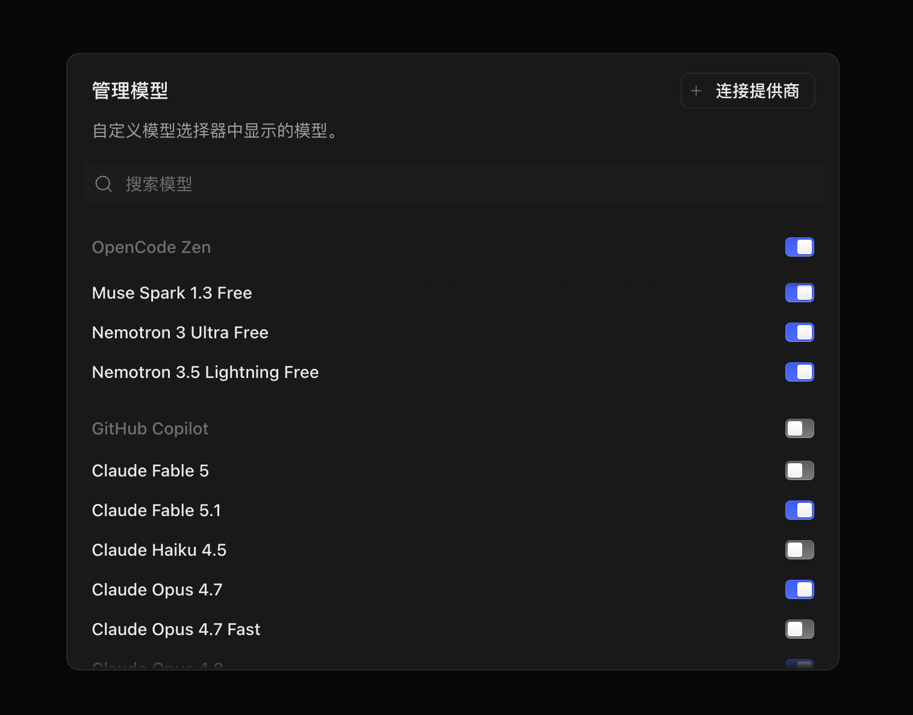
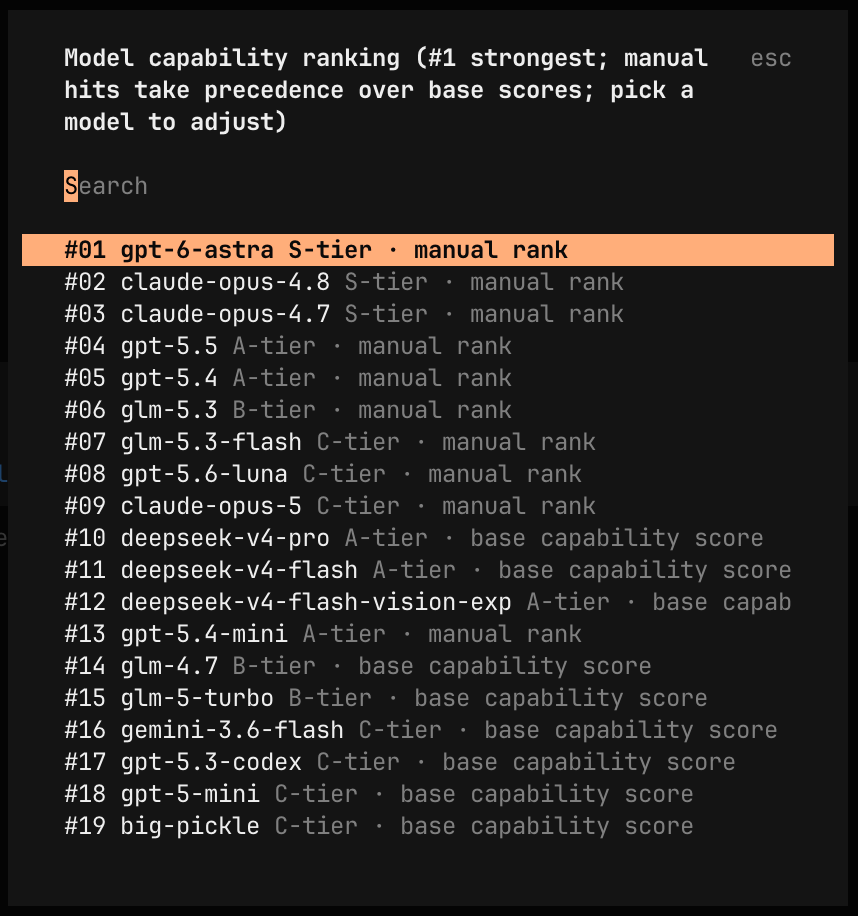
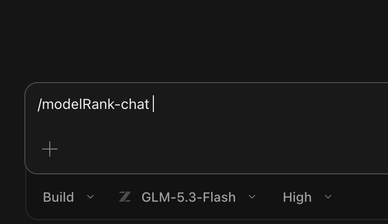
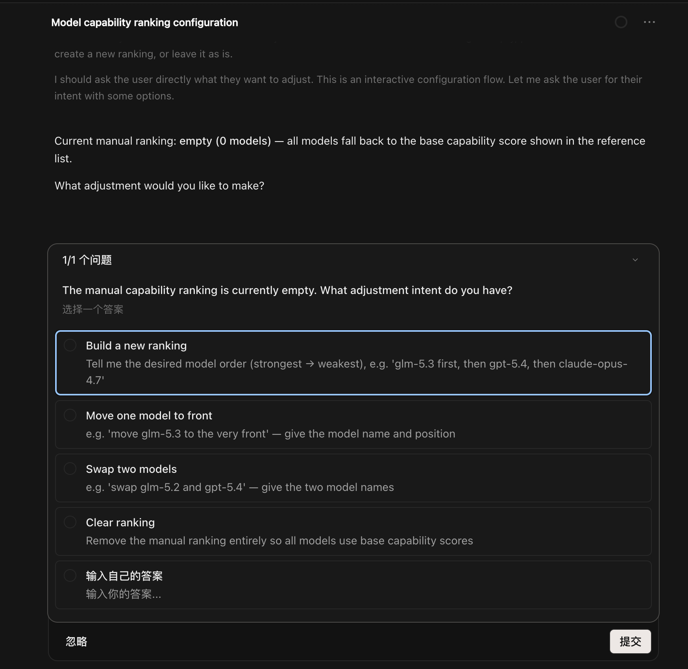
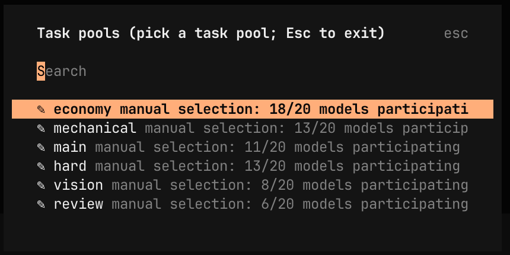
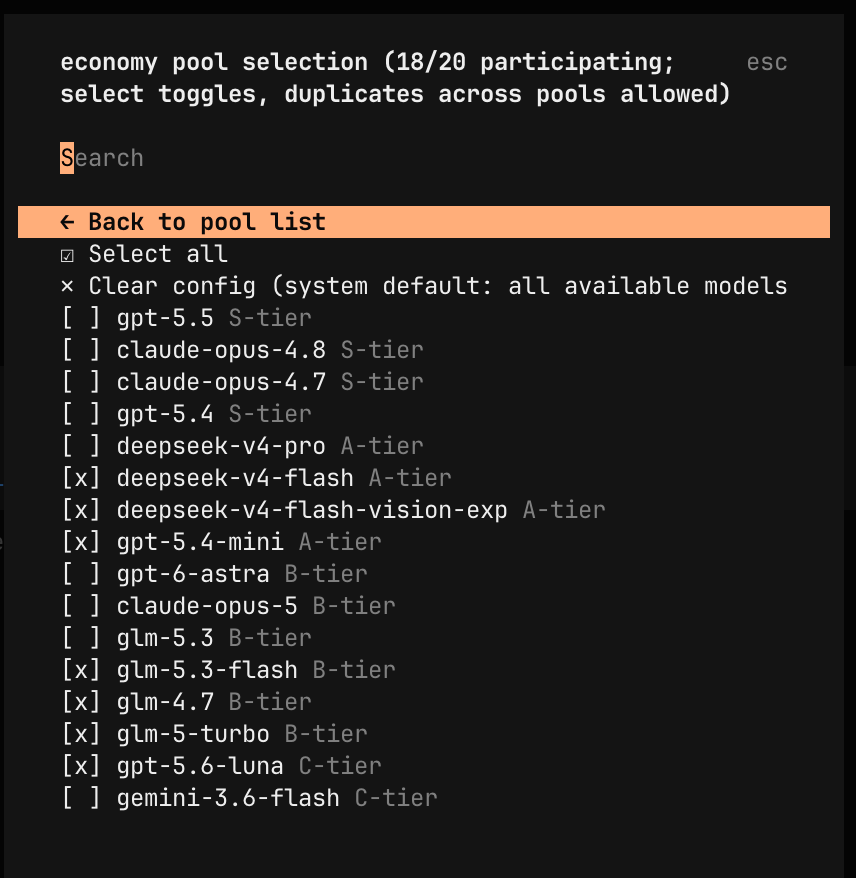
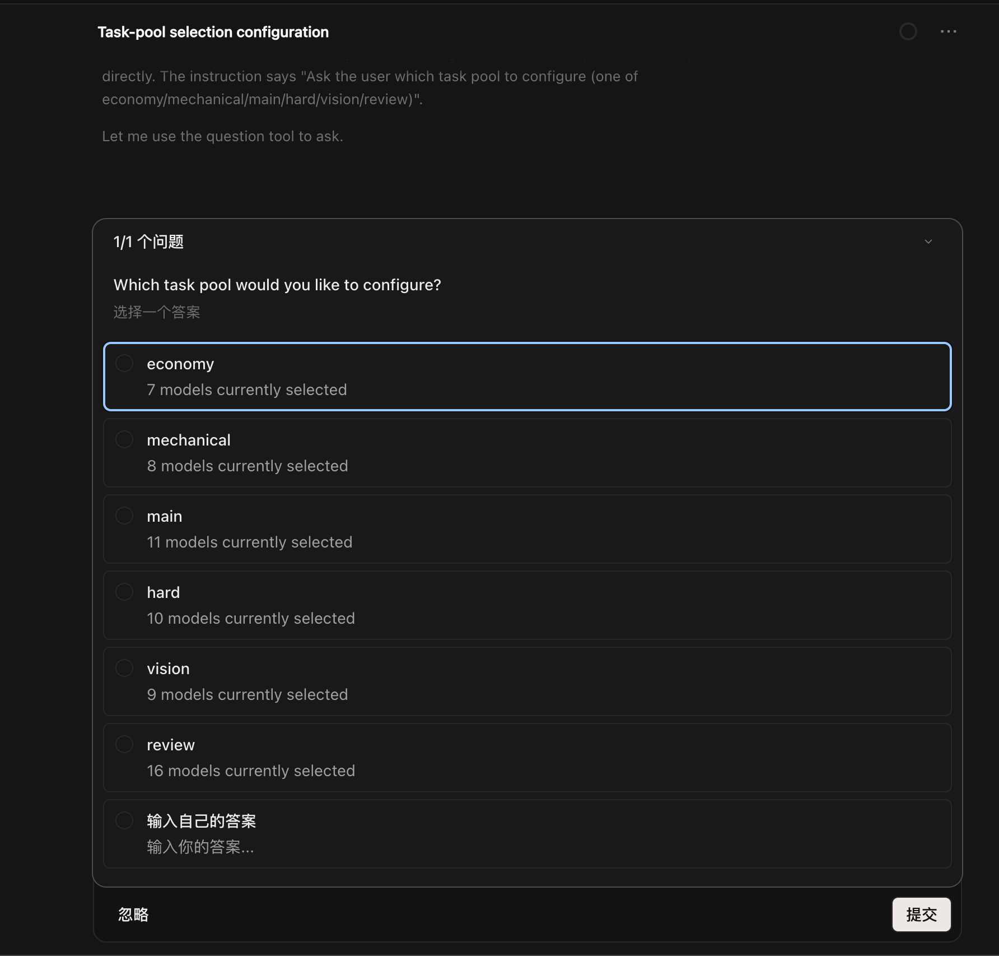

# Quick Start — from zero to a routed matrix in five steps

**English** | [Chinese](./quick-start.zh.md)

This walkthrough is for users who have just installed the plugin (or are about to) and want the shortest path to "everything works, and I know why". Each step tells you exactly what to type, shows a screenshot of what you should see, and states the exact scope and conditions under which that setting takes effect.

> **Where to configure**: use the **CLI/TUI first** — dialogs, the sidebar panel, and live banners are richest there. The **desktop app** is an optional alternative afterwards; both share the same config and state, and every manual override below works in either surface.

The five steps:

1. [Connect providers](#step-1--connect-providers) — give opencode credentials so models exist
2. [Pick the models that join orchestration](#step-2--pick-the-models-that-join-orchestration-favorites--visible-set) — favorites in the TUI, toggles in the app
3. [Rank models yourself (optional)](#step-3--optional-rank-models-yourself-modelrank-and-modelrank-chat) — `/modelRank` / `/modelRank-chat`
4. [Curate task pools (optional)](#step-4--optional-curate-task-pools-poolconfig-and-poolconfig-chat) — `/poolConfig` / `/poolConfig-chat`
5. [Restart, verify, and watch it route](#step-5--restart-verify-and-watch-it-route) — banners, sidebar, `/switchman-doctor`

---

## Step 1 — Connect providers

The plugin routes across **any opencode provider** — whatever has credentials in opencode becomes part of the orchestration surface. Three providers additionally get **quota-aware routing** (water levels, peak windows, exhaustion handling): GitHub Copilot, GLM, and DeepSeek.

In the TUI, run:

```text
/connect
```

- **GitHub Copilot** — search for *GitHub Copilot*, follow the OAuth device flow (enter the code at github.com/login/device). No API key needed.
- **DeepSeek** — search for *DeepSeek*, paste your API key from platform.deepseek.com.
- **GLM Coding Plan** — not in the `/connect` list; add it as a custom provider in your opencode config (`~/.config/opencode/opencode.json` or project `opencode.json`) and put your API key from open.bigmodel.cn:

```json
{
  "$schema": "https://opencode.ai/config.json",
  "provider": {
    "zhipuai-coding-plan": {
      "npm": "@ai-sdk/openai-compatible",
      "name": "Zhipu AI Coding Plan",
      "options": {
        "baseURL": "https://open.bigmodel.cn/api/coding/paas/v4",
        "apiKey": "YOUR_GLM_CODING_PLAN_API_KEY"
      }
    }
  }
}
```

In the desktop app you can reach provider sign-in from the model-management dialog's **"Connect provider"** button (top-right in the screenshot in Step 2).

> **Scope & conditions**
> - The plugin reads credentials **read-only** from opencode's auth layer (auth.json / provider options / env vars) — it never stores or refreshes secrets.
> - Provider keys matter: `zhipuai-coding-plan`, `deepseek`, and `github-copilot` are the stable keys the plugin recognizes for quota routing (near-miss spellings get a `/switchman-doctor` warning). Any other provider key is legal and routed with generic defaults.
> - Restart opencode after editing `opencode.json` so the provider surface is picked up.

## Step 2 — Pick the models that join orchestration (favorites / visible set)

Not every model a provider offers needs to join the matrix. You decide the **activation surface** — the set of models the plugin builds shells and lane chains from:

- **TUI**: open the model picker (`/models`) and press `ctrl+f` on a model to **favorite / unfavorite** it. Favorites are grouped at the top of the picker.


- **Desktop app**: open the model-management dialog and toggle models **on** (shown) or **off** (hidden).



> **Scope & conditions**
> - With the default `matrix.mode=auto`: **CLI/TUI activation surface = favorites**; **desktop app activation surface = models toggled on** (visible set).
> - Both surfaces **sync bidirectionally** (the fresher side wins by file mtime), so you can favorite in the TUI and see it reflected in the app, and vice versa.
> - **No favorites / nothing toggled on?** The plugin falls back to *active session models* (the union of current models across running main sessions) — you still get a working matrix, just a minimal one.
> - Favorites also carry a routing hint: within the same capability tier, favorited models are preferred in lane chains.
> - Surface changes (favorite added/removed, toggle flipped) trigger an immediate recomputation and probe refresh — no restart needed for this step.

## Step 3 — (Optional) Rank models yourself: /modelRank and /modelRank-chat

By default, model capability comes from an automatic cascade (live third-party index → bundled snapshot → curated table). If you disagree — your workload, your ranking.

**TUI**: run `/modelRank` — a dialog listing every model by effective capability, manual entries interleaved with base-score models; move a model up/down to anchor it a manual score between its new neighbors (one-spot nudges), or pin it to top / remove it from the ranking.



**Conversational** (TUI or desktop app — same flow in both): run `/modelRank-chat`. The agent shows the current ranking and asks what to adjust; you answer in plain language ("build a new ranking: glm-5.3 first, then gpt-5.4, then claude-opus-4.7") and it persists the result.





> **Scope & conditions**
> - A manual ranking **overrides the base capability score** for the models it contains (including prefix variants); unranked models are unaffected. Clearing the ranking (or removing a model from it) restores base scores.
> - Ranked models get an S/A/B/C tier from their position: ≤4 entries map to S/A/B/C in order; ≥5 entries use quantile buckets (top 20% S / next 20% A / next 20% B / rest C). Within a tier, rank position breaks ties.
> - The ranking feeds **every** decision surface: lane chains, effort affinity, capability gates, and deny/redirect hints.
> - Persisted to `~/.config/opencode/opencode-switchman/capability-rank.json` (order = strongest first); the file is hot-reloaded on change (mtime), instant effect, sidebar refreshes immediately. The `[LIMITS]` banner reports it as `manual capability rank: N models`.
> - CLI alternative: `node <pkg>/dist/switchman-config.js rank list|set|add|remove|clear`.

## Step 4 — (Optional) Curate task pools: /poolConfig and /poolConfig-chat

Dispatches land in one of six task pools — `economy` / `mechanical` / `main` / `hard` / `vision` / `review`. By default each pool considers every activated model, sorted by capability. Curation makes each pool deliberately different (lightweights only for economy, heavy thinkers only for hard).

**TUI**: run `/poolConfig` — pick a pool, then toggle models in/out of it.





**Conversational** (TUI or desktop app): run `/poolConfig-chat` — the agent shows a per-pool overview, you answer in plain language ("economy: keep only the flash models"), and it persists the change.



> **Scope & conditions**
> - A pool's manual list **replaces the system default candidate set** for that pool; models inside it are still recommended by capability. Pools without a configured (or with an empty) list keep the system default. "Clear config" restores the default for that pool.
> - The same model may join multiple pools.
> - Only models from the activation surface (Step 2) can be curated into pools — favorite/enable models first if something is missing from the list.
> - Persisted to `~/.config/opencode/opencode-switchman/pool-config.json` (key = pool name, value = model array); hot-reloaded on change, instant effect. The `[LIMITS]` banner reports it as `task-pool selection: M pools`.
> - CLI alternative: `node <pkg>/dist/switchman-config.js pool list|add|remove|set|clear` (pool name = economy/mechanical/main/hard/vision/review).

## Step 5 — Restart, verify, and watch it route

1. **Restart opencode** (required after Step 1 config edits; harmless otherwise).
2. **Check the banner** — every system prompt of your primary model now carries the live `[ROUTES]` / `[WATERMARK]` / `[LIMITS]` block. `[ROUTES]` shows the six lane chains; `[LIMITS]` reports your manual overrides (`manual capability rank: N models, task-pool selection: M pools`).
3. **Check the log** for `[opencode-switchman] injected N model shells (agents)` — N follows your activation surface from Step 2.
4. **Watch the sidebar** `switchman` panel — provider water levels, peak warnings, and each lane's current head candidate, refreshed every 2 seconds.


5. **Anything off?** Run `/switchman-doctor` — a local, credential-free diagnostic report that pinpoints missing credentials, misconfigurations, and near-miss provider keys.

That's it — from here just use opencode normally. Your primary model is now a dispatcher: it delegates by cognitive tier, respects quota water levels and peak windows, and every routing decision is traceable in the banner, the sidebar, and the `.switchman/` workspace.

---

## Cheat sheet: command × surface × scope

| Command / action | Where it works | What it controls | Takes effect | Persisted to |
| --- | --- | --- | --- | --- |
| `/connect` | TUI & app | Provider credentials | Models of credentialed providers join the selectable surface (restart after `opencode.json` edits) | opencode auth layer (plugin reads it read-only) |
| `ctrl+f` in the model picker (`/models`) | TUI | Favorites = CLI/TUI activation surface; same-tier preferred | Immediately (recompute + probe refresh) | opencode state (`model.json`), synced with the app |
| Model-management toggles | Desktop app | Visible set = app activation surface; synced with TUI favorites | Immediately (recompute + probe refresh) | opencode state (`opencode.global.dat`), synced with the TUI |
| `/modelRank` | TUI | Manual capability ranking, overrides base scores | Immediately (hot reload) | `~/.config/opencode/opencode-switchman/capability-rank.json` |
| `/modelRank-chat` | TUI & app | Same as `/modelRank`, conversational | Immediately (hot reload) | Same file as `/modelRank` |
| `/poolConfig` | TUI | Per-pool candidate lists, replace pool defaults | Immediately (hot reload) | `~/.config/opencode/opencode-switchman/pool-config.json` |
| `/poolConfig-chat` | TUI & app | Same as `/poolConfig`, conversational | Immediately (hot reload) | Same file as `/poolConfig` |
| `/expert <question>` | TUI & app | One-off expert consultation via the strongest read-only shell | Per call | — |
| `/switchman-doctor` | TUI & app | Local, credential-free diagnostics | Per call | — |
| `/switchman-update` | TUI & app | Upgrade the plugin to the latest release | After restart | opencode plugin config |

> Deeper dives: [Manual overrides](./reference.md#manual-overrides) · [Options (`opencode-switchman.jsonc`)](./reference.md#configuration-opencode-switchmanjsonc) · [How it works](./reference.md#how-it-works)
